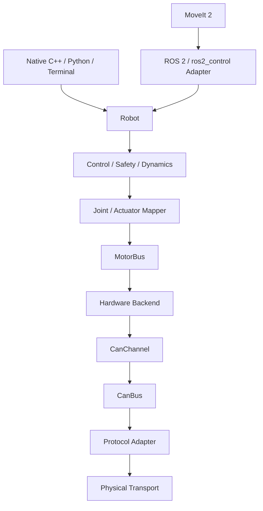

<div align="center">

# SerialArm-Core

Portable C++17 control, dynamics, safety and hardware abstraction core for custom serial manipulators

面向自研串联机械臂的 C++17 控制、动力学、安全与硬件抽象核心

[](https://github.com/Kaede-Rei/SerialArm-Core)
[](https://isocpp.org/)
[](https://docs.ros.org/en/humble/)
[](https://moveit.picknik.ai/)

</div>

## 项目简介

SerialArm-Core 是面向自研串联机械臂的通用能力库

Core 提供：

- Robot Model / Dynamics
- Control / Safety
- Joint / Actuator Mapping
- Hardware Backend contract
- Serial / CAN Transport
- Robot Profile
- C++ / Python API
- Terminal

主要使用入口：

| 场景 | 入口 |
| --- | --- |
| C++ 控制 | `Robot` |
| Python 控制 | `RobotSession` |
| 命令行调试 | `serial_arm_terminal` |
| 独立动力学 | `Dynamics` |
| 新执行器适配 | `MotorBus` + `HardwareLoader` |
| ROS 2 | `serial_arm_ros2_control` Adapter |

ROS 2 / ros2_control 是可选 Adapter，不是 Core 的运行前提

Reference robot 为 DM-Arm，reference hardware backend 为 Damiao

SerialArm-Core v0.4.0 introduces process-local shared physical bus ownership

一个 Physical Bus 由 Core 唯一持有

多个独立 Driver 可以共享同一个 Bus

CAN 通过 independent `CanChannel` instances 分流

Serial 通过 serialized `SerialBus::transaction()` 仲裁

## 架构



```text
Core
    通用机器人能力、Transport 契约与共享资源管理

Protocol
    通信设备私有协议

Hardware
    执行器语义与 MotorBus

Robot Support
    URDF、配置、Profile、MoveIt 等机器人资源

Framework Adapter
    ROS 2 / ros2_control 等外部框架
```

Damiao 链路：

```text
Robot
  ↓
DamiaoMotorBus
  ↓
CanChannel
  ↓
CanBus
  ↓
DamiaoUsbCanBus
  ↓
SerialPort
  ↓
达妙官方 USB2CAN
```

`DamiaoUsbCanBus` 只适配达妙官方 USB2CAN 模块的私有串口协议

### Shared CAN

同一进程中的多个驱动可以通过相同 bus name 从 `BusRegistry` 复用同一个 physical CAN bus，并分别持有自己的 `CanChannel`

```text
Robot / DamiaoMotorBus ── ARM CanChannel ──┐
                                           ├── BusRegistry ── DamiaoUsbCanBus ── physical CAN
External actuator ─────── Tool CanChannel ─┘
```

`CanChannel` 只负责通用 CAN transport 和有界 pending queue；具体协议层或 hardware 层负责根据 payload 识别设备；独立工具电机、附加轴或其他 CAN 外设不需要伪装成 Robot joint，也不需要向 `Robot` 或 `MotorBus` 增加 raw CAN API

Damiao hardware 在共享 `master_id = 0` 时会根据 feedback payload 中的 slave ID 识别电机；参数事务按照 `slave ID + RID + response type` 精确匹配，并在 timeout 内持续跳过无关 CAN 流量

### Shared Driver Contract

外部 CAN Driver 不拥有 physical CAN resource

它应通过已有 Protocol helper 或 `BusRegistry::get_or_create_can_bus()` 获取共享 `CanBus`，再创建自己的 `CanChannel`

Driver 销毁时只释放自己的 `CanChannel` 和 `std::shared_ptr`，不得主动关闭仍被其他 Driver 使用的 Bus

外部 Serial Driver 不长期保存 `SerialPort&`

它应通过 `BusRegistry::get_or_create<SerialBus>()` 获取共享 `SerialBus`，并把完整 request-response 放进同一个 `transaction()` callback

Core 只保证同进程 physical ownership、CAN channel fan-out 和 Serial transaction arbitration

不同厂家或不同协议能否共线仍取决于 bitrate、ID/地址、framing、主动发送行为、电气层和总线负载等兼容条件

## 能力

| 能力 | 状态 |
| --- | --- |
| C++17 Core | 已实现 |
| N-DOF serial arm | 已实现 |
| Pinocchio Dynamics | 已实现 |
| Safety / Mapping | 已实现 |
| 五种阻抗模式 | 已实现 |
| CAN Transport | `CanBus` / `CanChannel` / `BusRegistry` |
| Python Binding | 已实现 |
| C++ Terminal | 已实现 |
| Damiao Backend | Reference backend |
| ros2_control | 可选 Adapter |
| MoveIt 2 | 可选 |
| LeRobot | Planned |
| Isaac / Isaac Lab | Planned |

## 仓库结构

```text
src/
├── serial_arm/
│   ├── core/                 # Core、Transport、Python、Terminal
│   └── bringup/ros2_control/ # ROS 2 Adapter
└── robot_supports/
    ├── protocol/             # 通信协议
    ├── hardware/             # Hardware Backend
    ├── robots/               # Robot Support
    └── profiles/             # Robot Profile
```

## Quick Start

SerialArm-Core 支持 standalone CMake，也可以使用 colcon 一次性构建整个仓库

使用 `colcon build` 只是整仓构建方式，构建后仍可直接使用 Native C++、Python 和 Terminal，不要求通过 ROS 2 运行

### colcon 构建

```bash
cd SerialArm-Core

source /opt/ros/humble/setup.bash

rosdep install \
  --from-paths src \
  --ignore-src \
  -r -y \
  --rosdistro humble

colcon build
source install/setup.bash
```

开发时也可以：

```bash
colcon build --symlink-install
source install/setup.bash
```

### C++ Terminal

`SERIAL_ARM_BUILD_TERMINAL` 默认开启，colcon 构建后可直接运行：

```bash
serial_arm_terminal --robot-profile dm_arm_gray
```

查看参数：

```bash
serial_arm_terminal --help
```

直接指定安装路径也可以：

```bash
./install/serial_arm_core/bin/serial_arm_terminal \
  --robot-profile dm_arm_gray
```

不使用 Robot Profile 时：

```bash
serial_arm_terminal \
  --config <core.yaml> \
  --hardware-plugin <backend.so> \
  --hardware-config <hardware.yaml>
```

Terminal 直接使用 SerialArm-Core，不启动 ROS 2 node

真机写入由 Core 配置中的 `control.runtime.write_enabled` 决定

### Hardware connection

默认启动使用 `robot profile -> hardware.yaml` 中的硬件连接参数：

```bash
serial_arm_terminal --robot-profile dm_arm_gray
```

串口设备使用 `/dev/ttyACM*` 设备名；查看可用串口：

```bash
ls /dev/ttyACM*
```

如果机械臂枚举为 `/dev/ttyACM1`，可以只覆盖当前进程的串口：

```bash
serial_arm_terminal \
  --robot-profile dm_arm_gray \
  --serial-port /dev/ttyACM1
```

也可以临时覆盖波特率或 bus：

```bash
serial_arm_terminal \
  --robot-profile dm_arm_gray \
  --serial-port /dev/ttyACM1 \
  --baudrate 921600 \
  --bus main_can
```

ROS 2 hardware launch 同样支持运行时覆盖：

```bash
ros2 launch serial_arm_ros2_control hardware.launch.py \
  robot_profile:=dm_arm_gray \
  serial_port:=/dev/ttyACM1
```

硬件连接参数优先级为：

```text
runtime override > hardware.yaml
```

未被 runtime override 覆盖的字段继续使用 `hardware.yaml` 中的配置；Backend 默认值仅适用于 Backend 明确定义为可选的配置字段；runtime override 只影响当前进程，不会写回 `hardware.yaml`

### Python

colcon 会同时安装 `serial_arm` Python binding：

```bash
python3 -c "import serial_arm; print(serial_arm.__file__)"
```

从仓库根目录做配置检查：

```bash
python3 src/serial_arm/core/app/serial_arm_terminal.py \
  --robot-profile dm_arm_gray \
  --check-only
```

启动 Python Terminal：

```bash
python3 src/serial_arm/core/app/serial_arm_terminal.py \
  --robot-profile dm_arm_gray
```

主要控制入口：

```python
import serial_arm

session = serial_arm.RobotSession(
    core_yaml,
    hardware_plugin,
    hardware_yaml,
)
```

### C++ 项目接入

```cmake
find_package(serial_arm_core CONFIG REQUIRED)

add_executable(my_robot_app main.cpp)

target_link_libraries(my_robot_app
  PRIVATE
    serial_arm::core
    serial_arm::config
    serial_arm::robot
    serial_arm::dynamics
)
```

如果已经 `source install/setup.bash`，该 colcon install prefix 会进入 CMake 搜索环境

### Standalone CMake

只构建 Core：

```bash
cmake -S src/serial_arm/core -B build/serial_arm_core \
  -DCMAKE_BUILD_TYPE=Release \
  -DSERIAL_ARM_BUILD_PYTHON=OFF \
  -DSERIAL_ARM_BUILD_TERMINAL=OFF

cmake --build build/serial_arm_core -j
cmake --install build/serial_arm_core \
  --prefix install/serial_arm_core
```

Standalone 真机与 Terminal 的完整安装顺序见 [Tutorial.md](Tutorial.md)

### ROS 2 / ros2_control

仅在需要 ROS 2 时使用

模型预览：

```bash
ros2 launch serial_arm_ros2_control display.launch.py \
  robot_profile:=dm_arm_gray
```

ros2_control 真机：

```bash
ros2 launch serial_arm_ros2_control hardware.launch.py \
  robot_profile:=dm_arm_gray
```

MoveIt 2 真机：

```bash
ros2 launch serial_arm_ros2_control moveit.launch.py \
  robot_profile:=dm_arm_gray
```

`display.launch.py` 不连接 Hardware Backend

`hardware.launch.py` 和 `moveit.launch.py` 会连接真实 Hardware Backend

## Robot Profile

Robot Profile 将 Core、Hardware、URDF、Controllers 和可选 MoveIt 配置聚合为一个机器人实例

```yaml
profiles:
  dm_arm_gray:
    core:
      package: dm_arm_description
      config: config/core/gray.yaml
    hardware:
      plugin: serial_arm_hardware_damiao
      config_package: dm_arm_description
      config: config/hardware.yaml
```

C++、Python、Terminal 和 ROS 2 Adapter 共用同一套 Robot Profile

## 扩展

| 场景 | 修改位置 |
| --- | --- |
| 新 Robot Variant | Robot Support + Profile |
| 新机械臂 + 已有 Backend | Robot Support + Profile |
| 新 Hardware Backend | `robot_supports/hardware/<backend>` |
| 新通信设备协议 | `robot_supports/protocol/<protocol>` |
| ROS 2 接入 | 复用 `serial_arm_ros2_control` |
| 修改通用 Control / Safety / Dynamics | `serial_arm/core` |

Hardware Backend 通过 `MotorBus` 接收统一的 `position / velocity / torque / kp / kd` 语义

## 文档

- [Tutorial.md](Tutorial.md)：完整构建、配置、真机、调参与扩展教程
- [API.md](API.md)：C++ / Python / Transport / Hardware API Reference

## License

许可证以仓库 [LICENSE](LICENSE) 为准
