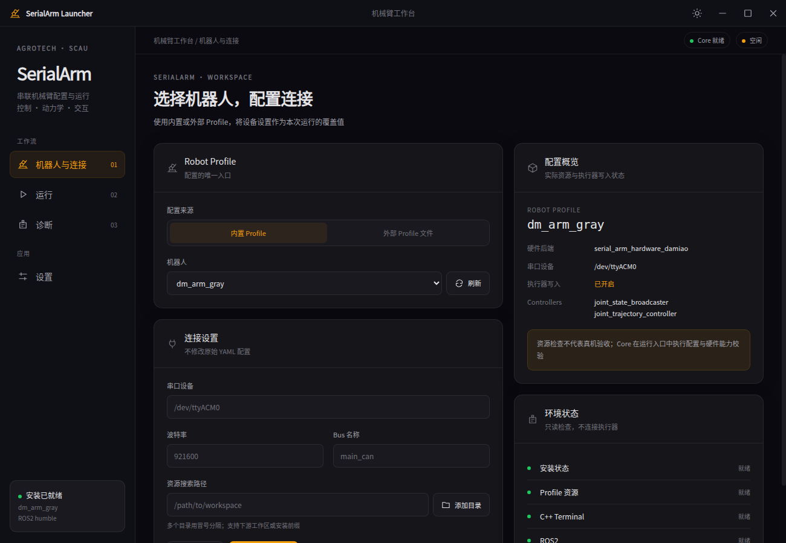
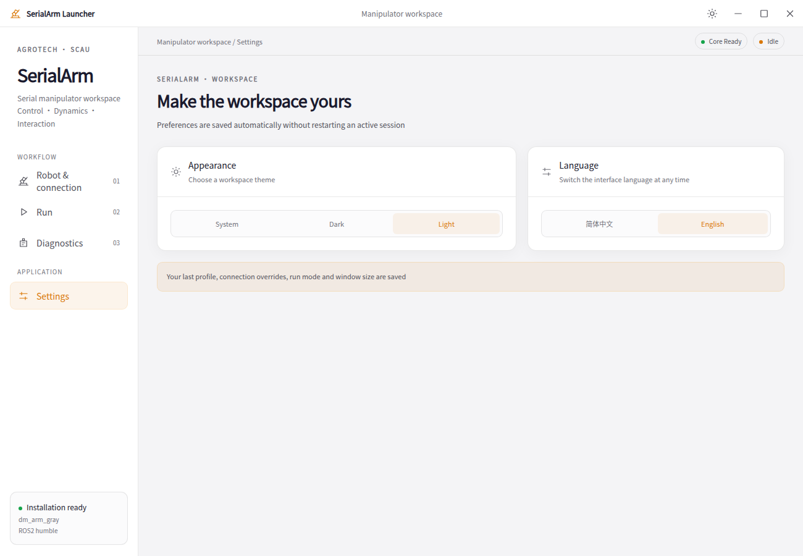

# GUI

## 打开

```bash
./install.sh
./launch.sh
```

已有 Core 时补装 GUI 使用 `./install.sh --gui-only --yes`

GUI 需要 Node.js 20+、npm 和 Linux 桌面环境，启动脚本自动加载安装环境

## 选择机器人

1. 选择内置 Profile 或外部 `robot_profiles.yaml`
2. 选择机器人名称
3. 检查串口、波特率、Bus 与资源搜索路径
4. 点击检查配置，再选择运行方式

连接参数留空使用 Profile 默认值，填写后只覆盖本次运行

多个资源目录用冒号分隔，可使用下游工作区或安装前缀

GUI 不修改 YAML，外部模型、硬件后端、Controllers 与 MoveIt 资源仍由下游项目提供

## 运行

| 模式 | 入口 | 作用 |
| --- | --- | --- |
| Model | `display.launch.py` | 查看模型、关节与 RViz |
| Terminal | `serial_arm_terminal` | 保留 C++ 菜单与键盘交互 |
| Hardware | `hardware.launch.py` | 启动 ros2_control 与 Controllers |
| MoveIt | `moveit.launch.py` | 启动硬件、规划与 RViz |

缺少组件或资源时启动按钮不可用，可到诊断页查看原因

Terminal、Hardware 与 MoveIt 启动前需要确认 Profile、设备和 `write_enabled`

确认不改变 YAML 的执行器写入开关，配置改变后需重新检查

Terminal 使用 PTY，点击终端后输入，运行中不能修改连接参数或切换会话

停止先发送 SIGINT，等待退出后才能切换模式，强制结束会中断清理流程

关闭窗口时如有活动会话，会询问停止或强制结束

同一用户的 Launcher 按实际设备路径互斥，直接运行底层程序不受此锁约束

## 诊断与偏好

诊断只读取文件与权限，不实例化 Hardware、不打开串口

配置语义与硬件能力仍由运行入口校验，资源检查通过不代表真机验收通过

```bash
./launch.sh --doctor
./launch.sh --doctor \
  --profile tomato_picker \
  --profile-file /absolute/path/robot_profiles.yaml \
  --resource-paths /absolute/path/workspace
```

设置支持中英文与系统、深色、浅色主题，切换不会重启进程

窗口、Profile 与连接偏好保存在 `~/.config/serial-arm/launcher.json`

终端可滚动查看和清空显示，不做长期日志归档，安装日志位于 `log/unified/`

## 界面

截图来自离线界面测试，不表示已经连接真机





验证命令见 [开发说明](development.md)
